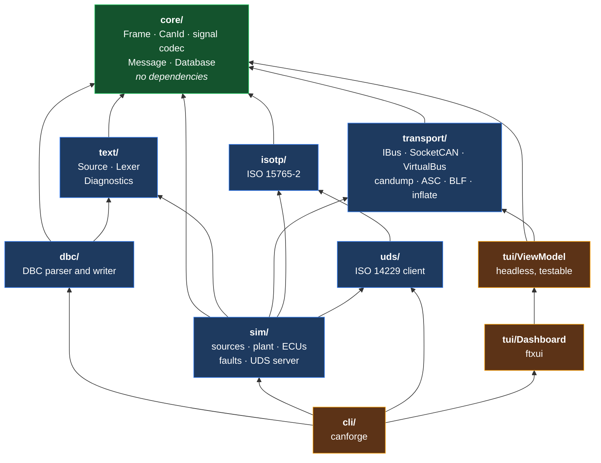

# canforge

A CAN bus toolkit in C++17: DBC parsing, a bit-exact signal codec, a simulated
multi-ECU bus, ISO-TP and UDS diagnostics, and a terminal dashboard. I wrote and
tested all of it without touching a single piece of CAN hardware.

[](https://github.com/TheModelStudent/canforge/actions/workflows/ci.yml)


## Why

A car is thirty to a hundred small computers that have to agree with each other.
The engine controller knows the crankshaft speed, the dashboard needs to draw it,
the transmission needs it to decide when to shift. CAN is the wire they share:
two wires, invented at Bosch in the 80s, in every vehicle built since the
mid-90s and in a lot of industrial and agricultural machinery besides.

The catch is that CAN messages don't describe themselves. A frame is an
identifier plus up to eight bytes (64 with CAN FD), and what those bytes actually
*mean* lives in a separate database file: which signal starts at which bit, how
wide it is, which byte order, what to multiply the raw integer by, what unit
comes out the other end. That format is DBC, which Vector Informatik defined and
never fully published.

Getting the bit extraction right is more or less the whole job. Little-endian is
easy. Big-endian is where people get it wrong, because the start bit is the
*most* significant bit and the signal grows toward *lower* bit numbers, so it
isn't a contiguous run in the obvious numbering. I wanted to write that properly,
from the spec, and then prove it was right rather than assume so.

That turned into everything else here: something to generate realistic traffic to
decode, then the diagnostic protocols that ride on top, then a way to watch it
all happen.

## Try it

```sh
cmake -S . -B build -G Ninja -DCMAKE_BUILD_TYPE=RelWithDebInfo && cmake --build build

# inspect a database
./build/cli/canforge info --database dbc/tests/data/powertrain.dbc

# watch a simulated vehicle on a simulated bus
./build/cli/canforge dash --config sim/tests/data/vehicle.cfg --virtual

# flash firmware onto a simulated ECU over UDS
head -c 2048 /dev/urandom > firmware.bin
./build/cli/canforge uds --virtual --download firmware.bin
```

`--virtual` uses the in-process bus, so none of that needs `sudo`, the `vcan`
module, or a CAN interface. Against a real kernel interface instead:

```sh
sudo modprobe vcan && sudo ip link add dev vcan0 type vcan && sudo ip link set up vcan0
./build/cli/canforge sim --config sim/tests/data/vehicle.cfg --bus vcan0
```

> **Screen recordings.** I haven't committed the GIFs yet.
> [`docs/dashboard.tape`](docs/dashboard.tape) and [`docs/uds.tape`](docs/uds.tape)
> are [vhs](https://github.com/charmbracelet/vhs) scripts that record them
> (`vhs docs/dashboard.tape`), and both run on the in-process bus, so you can
> reproduce them yourself with no hardware and no root. The captured text of the
> UDS firmware download is in [`docs/uds-session.txt`](docs/uds-session.txt) if
> you'd rather just read it.

## Where to start reading

`core/src/Signal.cpp` is the bit extraction, and
`core/tests/test_signal_golden.cpp` is the 78 layouts I worked out by hand to
check it. Reading those two together is the fastest way to see whether I know
what I'm doing. After that, `isotp/src/Transport.cpp` for the state machine and
`sim/src/UdsServer.cpp` for the diagnostic side.

## How it fits together

A lower layer never knows about a higher one, and the CMake link graph enforces
that rather than a comment asking politely.



Two bits of that are worth explaining. `isotp` depends only on `core` because
it's a pure state machine driven by `on_frame()` and `poll(now)` and never
touches a bus at all, which is also why every one of its timeouts is testable to
the microsecond against a fake clock. And `text/` exists because the simulator's
config parser wanted the same scanner the DBC parser uses; making `sim/` link a
whole DBC parser just to read its own config file seemed silly, so the generic
parts moved down a layer.

No library layer has any dependency. GoogleTest and ftxui are fetched by CMake
and only the tests and the dashboard ever see them.

## What's in it

**Signals and frames.** Classic CAN and CAN FD, 11- and 29-bit identifiers, both
byte orders, 1 to 64 bits at any offset, signed and unsigned, IEEE floats via
`SIG_VALTYPE_`, scaling and offsets, value tables. An out-of-range identifier
won't compile if it's a constant and won't construct if it isn't. The codec is
allocation-free and there's a test that proves it by replacing global
`operator new` with one that aborts.

**DBC.** Parser and writer, simple and extended (`SG_MUL_VAL_`) multiplexing,
attributes, comments, value tables. Errors come out looking like compiler errors,
with a line, a column, the offending token and a caret under it, because a 40,000
line database from a supplier is impossible to debug otherwise. It tolerates the
things real files do (BOMs, CRLF, Latin-1, missing semicolons, `3PMS` as a node
name) and each tolerance is commented where it's handled with the tool that needs
it named.

**A bus that behaves like a bus.** The virtual backend models bit timing and
arbitration, not just a queue: a frame occupies the medium for the number of
microseconds its length and worst-case stuffing say it should, and when two nodes
transmit at once the lower identifier wins while the loser keeps its frame and
retries. That's enough to reproduce priority starvation on demand, which is the
whole reason to model it. Time is virtual, so the tests are deterministic and
take no wall-clock time.

**Logs.** candump and Vector ASC read and write; BLF read-only. BLF meant writing
a DEFLATE decompressor from scratch, since the library layers aren't allowed a
zlib dependency and BLF is the format real automotive logs actually arrive in.

**Diagnostics.** ISO-TP with segmentation, flow control, the `FF_DL = 0` escape
for transfers over 4095 bytes, and STmin down to 100 µs. On top of that a UDS
client covering ten services, including a complete firmware download verified
byte by byte against a simulated ECU.

**Simulator and dashboard.** A longitudinal vehicle model drives ECUs that
transmit on a schedule with rolling counters and CRCs, plus seeded fault
injection. The dashboard shows a live trace, per-message period and jitter, bus
load, and signal plots. All of the dashboard's logic lives in a `ViewModel` with
no ftxui in it, which is the only reason any of it is testable.

Every claim above has a test behind it. `ctest --test-dir build` runs all 383,
and the suite breakdown is further down.

## Benchmarks

GCC 11.4 at `-O3`, aarch64 in a container. Reproduce with
`./build/bench/canforge_bench_codec` and `./build/bench/canforge_bench_pipeline`.

Signal codec, single-threaded, over a 12-signal powertrain mix and 4096 distinct
frames:

| operation | throughput | per signal |
|---|---:|---:|
| `decode_raw`, bit extraction only | 467 M/s | 2.14 ns |
| `decode`, extraction plus scaling | 304 M/s | 3.29 ns |
| `encode_raw`, bit insertion only | 369 M/s | 2.71 ns |
| `decode_raw_reference`, one bit at a time | 157 M/s | 6.37 ns |

And the rest of the pipeline:

| operation | result |
|---|---:|
| Parse a 5000-signal / 625-message DBC (345 KiB) | 6.9 ms (51 MB/s) |
| Write it back out | 4.8 ms |
| `Database::validate()` on it | 0.4 ms |
| Virtual bus: arbitrate and deliver 200,000 frames | 10 ms, so 19.4 M frames/s |
| ...which is 54 s of simulated 500 kbit/s bus time | 5224x real time |
| Identifier lookup plus decode of every signal | 215 M signals/s |

For scale, a 500 kbit/s bus saturated with 8-byte frames carries about 3700
frames per second, so decoding every signal of every frame costs roughly 0.02% of
one core. The codec is not the bottleneck in anything.

`bench/canforge_soak` ran 467,000 frames across 31 simulated minutes with the
view model snapshotting at 60 Hz throughout. Resident set was flat at 6136 KiB
from about t=12 s to the end. Every accumulating structure is capped: the trace
ring buffer, the signal history, the frames-per-second window, and the
per-message statistics, which keep a running mean instead of a stored history.

## Fuzzing, and what it actually found

Four targets in `fuzz/`: the DBC parser, the BLF reader, the ASC and candump
readers, and the ISO-TP reassembler. They're written against the libFuzzer entry
point, and there's a standalone driver so the same targets run under GCC with
ASan where clang isn't available.

They found one real bug, in the BLF reader. A log container header carries an
`uncompressedSize` field that the file controls, and it went straight into
`std::vector::reserve()`. A 200-byte file could therefore ask for a 4 GiB
allocation, which is a denial of service in anything that opens an untrusted log.
The fix clamps the hint, bounds the output during inflation at 256 MiB, and
rejects an implausible header size outright.

I want to be straight about the scale of this, though, because one bug in a table
looks better than it is. The development container has no clang, so libFuzzer
never ran here. Everything below came from the standalone GCC driver, which is a
mutation fuzzer with no coverage feedback and is therefore a lot weaker:

| target | executions | crashes |
|---|---:|---:|
| `fuzz_dbc` | 135,000 | 0 |
| `fuzz_blf` | 104,000 | 1, fixed above |
| `fuzz_asc` | 150,000 | 0 |
| `fuzz_isotp` | 900,000 | 0 |

That's about 1.3 million executions rather than the 10 million per target I'd
planned, and without coverage guidance it explores far less of the state space.
The `fuzz-long` CI job runs each target to 10 million under real libFuzzer on a
weekly schedule, and those runs haven't happened yet. Treat that table as a floor,
not a result. The corpus is committed and replayed on every CI run, so anything
found later becomes a permanent regression test.

## Tests

383 of them.

| suite | tests | covers |
|---|---:|---|
| `core_tests` | 83 | Result, CanId, frame layout, DLC tables, 78 hand-computed codec vectors, 8 property tests over 20,000 layouts each |
| `core_no_alloc_test` | 5 | the allocation trap, and its own self-check |
| `dbc_tests` | 65 | lexer, parser, diagnostics, multiplexing, round-trip, one case per error class |
| `transport_tests` | 69 | timing, arbitration, filters, inflate, three log formats, replay (6 skipped without vcan0) |
| `isotp_tests` | 41 | segmentation, every timeout, every error, STmin to the microsecond, property tests |
| `uds_tests` | 34 | every service, the NRC table, responsePending, a full 4 KB firmware download |
| `sim_tests` | 57 | signal sources, plant physics, ECU scheduling, counters and checksums, config diagnostics, every fault |
| `tui_tests` | 25 | period and jitter measurement, filtering, ring buffers, sparkline scaling, thread safety |
| `fuzz_corpus_*` | 4 | replay every committed fuzzing input |

The 78 golden vectors in `core/tests/test_signal_golden.cpp` are the part I'd
point at first. Each one was worked out by hand from the bit-numbering rules with
the derivation written into a comment above it, so you can check the arithmetic
without trusting my implementation. Several are published J1939 parameters (SPN
190 engine speed, SPN 84 wheel speed, SPN 110 coolant temperature, SPN 91 pedal
position), where the physical result is documented independently of any decoder.
A codec that generates its own expected values proves nothing.

What I ran locally, on GCC 11.4 / aarch64: warning-clean at `-Werror` in both
`Debug` and `RelWithDebInfo`, all 383 tests, the `find_package` consumer building
and running, both CLI demos end to end, and the soak test.

There was no clang and no root in the container I built this in, so the first CI
run was the first time any of this met clang, TSan, clang-format or a real kernel
interface. It found three things, all portability rather than logic:

- clang rejects an unused namespace-scope `constexpr` under `-Werror` where GCC
  says nothing at all. One dead constant in the CLI broke every clang job.
- Both `NoAllocSelfCheck` tests passed on GCC and failed on clang. C++14 lets a
  compiler delete a `new`-expression whose allocation it can prove unnecessary,
  and clang does exactly that at `-O2`, so the self-checks were being optimised
  out of existence: the failure they exist to catch. They now call
  `::operator new` directly, which is an ordinary function call and stays put.
- The allocation trap cannot link under TSan, whose runtime defines
  `operator new` itself. Sanitizer builds now switch that target off rather than
  filtering the tests out after the fact.

The second one is my favourite bug in the project. A test that silently stops
testing anything is worse than no test, and it took a second compiler to show it.

The clang-tidy job is still red, and it is the one thing here I have not
finished. It was misconfigured twice over: `HeaderFilterRegex` matched on the
word "canforge", and CI checks out at `.../canforge/canforge/`, so it was linting
the whole of GoogleTest and ftxui; and it was being handed `.hpp` files, which
have no entry in the compilation database and so get parsed with no include
paths. Both are fixed. What is left is that the check set turns on `modernize-*`
and `readability-*` wholesale, and the codebase disagrees with a few thousand of
those on style. Narrowing that to the checks the project actually wants to
enforce is real work and I would rather leave it visibly unfinished than silence
the checks to get a green tick.

One more thing worth keeping: the sanitizer build compiles at `-O1` and caught
two `-Wsign-conversion` warnings the `-O2` build didn't, because the optimiser
could no longer prove the ranges. Building at more than one optimisation level
turned out to be part of the check, not a formality.

## What I'd do differently

The BLF reader is guesswork with tests around it. The format is undocumented and
Vector's SDK headers disagree with python-can about where a container's payload
starts, so the reader sniffs which layout it's looking at. That works against
fixtures I built to match both, but I've never fed it a log from a real Vector
tool. I should have found a real capture first and written the reader against it
instead of writing it and hoping.

The vehicle model should have been a lookup table. I wrote the torque curve as a
piecewise function with hand-tuned constants, so every behaviour change meant
editing arithmetic. A table of (rpm, throttle) to torque with interpolation would
be less code, easier to tune, and closer to how engine maps actually work.

`Result<T, E>` isn't constexpr and that leaked into the API. A union with a
non-trivially-destructible alternative can't have a constexpr destructor in C++17,
so `CanId` needed a separate `make_standard<Id>()` path for compile-time
constants alongside the runtime `standard()` that returns a `Result`. Two ways to
build the same thing is a wart. It goes away on C++23 with `std::expected`.

The fuzzers belonged near the start, not at the end. The one bug they found was
in code that had already passed 63 unit tests. Fuzzing a parser is cheap and
finds a category of bug that example-based tests structurally can't, so there was
no good reason to leave it until last.

The dashboard's transmit panel is thinner than everything around it. It parses
`Signal=value` pairs with an `istringstream` and reports failures as a status
string. Every other input path in the project has typed errors and real
diagnostics; that one doesn't, because I ran out of room. It should use the same
`text::Lexer` the config parser does.

Extended multiplexing took three attempts. I first modelled the multiplex role as
a single enum, which can't express `m0M`, a signal that's both switched in by an
outer multiplexor and itself switching an inner group. Then I modelled presence as
one comparison against the root multiplexor, which is wrong for nested groups. The
version that works walks the multiplexor chain upward. Reading `SG_MUL_VAL_`
properly before writing any of it would have saved all three.

## References

ISO 11898-1:2015 for frame formats, arbitration, bit stuffing, the DLC tables,
the reserved base-identifier rule and the removal of the remote frame from CAN FD.
ISO 15765-2:2016 for ISO-TP. ISO 14229-1 for UDS. ISO 15031-6 / SAE J2012 for DTC
numbering and the P/C/B/U letters. SAE J1850 for the CRC-8 polynomial the
simulator uses, and SAE J1939 for the parameter definitions behind the golden
vectors. RFC 1951 and RFC 1950 for DEFLATE and zlib.

DBC has no public specification. The format is whatever Vector's CANdb++ emits,
so every deviation this parser tolerates is documented at the point where it's
handled, naming the tool that produces it.

## Licence

MIT. See [LICENSE](LICENSE).
