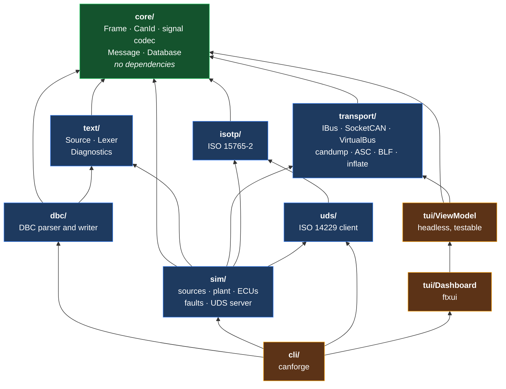

# canforge

A CAN bus toolkit in C++17: DBC parser, bit-exact signal codec, virtual multi-ECU bus with arbitration, ISO-TP transport, UDS diagnostics, vehicle simulator and live terminal dashboard — built and tested with no CAN hardware.

<!-- GIF 1: the dashboard with the vehicle simulation running. -->


<!-- GIF 2: the simulated UDS firmware download. -->


> The two GIFs are not committed. `docs/dashboard.tape` and `docs/uds.tape` are
> [vhs](https://github.com/charmbracelet/vhs) scripts that record them:
> `vhs docs/dashboard.tape`. Both run on the in-process bus, so recording needs
> no hardware and no root. The captured text of the UDS run is in
> [`docs/uds-session.txt`](docs/uds-session.txt) if you would rather read it.

---


---

## What is CAN, and what is this?

A car is thirty to a hundred small computers that have to agree with each other.
The engine controller knows the crankshaft speed; the dashboard needs to draw it;
the transmission needs it to decide when to shift. CAN is the wire they share to
do that — a two-wire bus, invented at Bosch in the 1980s, used by every vehicle
built since the mid-1990s and by most industrial machinery, agricultural equipment
and building automation. It carries short messages: an 11-bit or 29-bit identifier
and up to eight bytes of data, or up to 64 with the newer CAN FD.

Those bytes are not self-describing. A message is a bag of bits, and the meaning
lives in a separate database file — which signal sits at which bit offset, how
many bits wide, little-endian or big-endian, what to multiply the raw integer by,
what unit the result is in. The de-facto format for that database is DBC, which
Vector Informatik defined and never fully published. Getting the bit extraction
right is the whole job, and the big-endian case is genuinely error-prone: the
start bit denotes the *most* significant bit and the signal grows toward *lower*
bit numbers, which is not a contiguous run in the obvious numbering.

canforge is a toolkit for all of that. It parses DBC databases and reports errors
in them the way a compiler reports errors in source code. It encodes and decodes
signals bit-exactly for both byte orders. It simulates a bus of ECUs driven by a
vehicle physics model, so there is realistic traffic to look at without a car. It
speaks ISO-TP and UDS, the protocols used to read fault codes out of an ECU and to
flash new firmware onto one. And it shows all of it in a terminal dashboard.
Everything runs against Linux's virtual CAN interface or an in-process simulated
bus; no CAN hardware was used at any point in building it.

## Quickstart, zero hardware and zero root

```sh
cmake -S . -B build -G Ninja -DCMAKE_BUILD_TYPE=RelWithDebInfo && cmake --build build

# 1. inspect a database
./build/cli/canforge info --database dbc/tests/data/powertrain.dbc

# 2. watch a simulated vehicle on a simulated bus
./build/cli/canforge dash --config sim/tests/data/vehicle.cfg --virtual

# 3. flash firmware onto a simulated ECU over UDS
head -c 2048 /dev/urandom > firmware.bin
./build/cli/canforge uds --virtual --download firmware.bin
```

`--virtual` uses the in-process bus. Nothing above needs `sudo`, the `vcan`
module, or a CAN interface. To use a real kernel interface instead:

```sh
sudo modprobe vcan && sudo ip link add dev vcan0 type vcan && sudo ip link set up vcan0
./build/cli/canforge sim --config sim/tests/data/vehicle.cfg --bus vcan0
```

## Architecture

A lower layer never knows about a higher one, and the CMake link graph enforces it
rather than a comment asking politely.



Two notes on the shape. `isotp` depends only on `core`, because it is a pure state
machine driven by `on_frame()` and `poll(now)` and never touches a bus. And
`text/` exists because the simulator's config parser needed the same scanner the
DBC parser uses; rather than have `sim/` link a DBC parser to read its own config
file, the generic parts were promoted into their own layer.

Dependencies: none in any library layer. GoogleTest and ftxui are fetched by
CMake and are used only by the tests and the dashboard respectively.

## Features

Every row names the test that proves it. `ctest -R <name>` runs it.

| Feature | Verified by |
|---|---|
| 11-bit and 29-bit identifiers; an ill-formed one is unconstructible | `CanId.StandardBoundaries`, `CanId.CompileTimeConstruction` |
| Classic frame is 24 bytes and trivially copyable; FD frame is 80 | `Frame.LayoutContract` (also `static_assert`) |
| CAN FD DLC↔length table including the 9→12, 13→32, 15→64 steps | `Dlc.FdMapping`, `Dlc.FdRoundsUpAndReportsPadding` |
| Classic DLC 9–15 preserved so a log round-trip is byte-identical | `Frame.FromWirePreservesReservedClassicDlc` |
| Intel signal decode, 1–64 bits, any offset | `GoldenRaw.IntelExtraction` — 21 hand-computed vectors |
| Motorola decode, including cross-byte and cross-32-bit-boundary | `GoldenRaw.MotorolaExtraction` — 26 hand-computed vectors |
| Two's-complement sign extension at arbitrary bit widths | `GoldenSigned.TwosComplementAtArbitraryWidths` |
| Published J1939 parameters decode to their documented values | `GoldenScaled.PublishedParameterDefinitions` |
| IEEE float and double signals (`SIG_VALTYPE_`), both byte orders | `GoldenFloat.IeeeSignals` |
| 64-bit signals spanning nine bytes | `GoldenWide.SixtyFourBitSignalSpanningNineBytes` |
| The fast codec agrees with the bit-at-a-time reference | `CodecProperty.FastPathAgreesWithReferenceOnExtraction` — 20 000 layouts |
| Encoding never disturbs a bit outside its own signal | `CodecProperty.EncodingTouchesOnlyItsOwnBits` |
| Round-trip within one quantisation step | `CodecProperty.PhysicalRoundTripWithinQuantisationStep` |
| The codec allocates nothing, so it is callable from an RT context | `NoAlloc.SignalCodecAllocatesNothing` + `NoAllocSelfCheck.TheTrapActuallyFires` |
| DBC messages, signals, nodes, comments, attributes, value tables | `Parser.PowertrainStructure`, `Parser.EveryAttributeType` |
| DBC simple, range-based and two-level nested multiplexing | `Parser.NestedMultiplexing`, `Parser.ExtendedMultiplexingRanges` |
| DBC extended identifiers carried in bit 31 | `Parser.ExtendedIdentifiersUseBitThirtyOne` |
| DBC tolerances: BOM, CRLF, Latin-1, missing newline and semicolons | `Parser.QuirkyFileParses`, `Source.TranscodesLatin1` |
| DBC parse → write → parse produces an identical database | `RoundTrip.ParseWriteParseIsIdentical` |
| DBC diagnostics carry line, column, offending token and a caret | `Errors.DiagnosticsPointAtTheOffendingLine` |
| One diagnostic per error class; parsing continues past an error | `Errors.EachMalformedFileFailsWithItsOwnDiagnostic` |
| Worst-case frame timing: 135 bits standard, 160 bits extended | `Timing.ClassicWorstCaseMatchesThePublishedFigures` |
| Arbitration: the lowest identifier wins, the loser retransmits | `Arbitration.TheLoserRetransmitsRatherThanLosingTheFrame` |
| Arbitration: standard beats extended on the same base identifier | `Arbitration.StandardBeatsExtendedWithTheSameBaseIdentifier` |
| Arbitration: priority starvation is reproducible on demand | `Arbitration.AHighPriorityTalkerCanStarveALowPriorityOne` |
| SocketCAN: FD frames, filters, timestamps, on a real interface | `SocketCan.*` — CI `vcan` job; skipped without vcan0 |
| candump and Vector ASC read and write, byte-identical round-trip | `Candump.RoundTripsThroughTheWriter`, `Asc.RoundTripsThroughTheWriter` |
| Vector BLF read: both published container layouts, zlib and stored | `Blf.HandlesBothPublishedContainerLayouts` |
| DEFLATE decompressor written from scratch (RFC 1951 / 1950) | `Inflate.RoundTripsEveryBlockType` |
| ISO-TP: a 4000-byte transfer, byte-exact, over the virtual bus | `IsoTp.FourThousandBytesAcrossTheVirtualBus` |
| ISO-TP: the `FF_DL = 0` escape for transfers above 4095 bytes | `IsoTpProperty.SizesAroundTheEscapeBoundary` |
| ISO-TP: STmin 0–127 ms and 100–900 µs; reserved values → 127 ms | `StMin.SubMillisecondRange`, `StMin.ReservedValuesBecomeTheSlowestRate` |
| ISO-TP: N_Bs, N_Cr and N_Br honoured to the microsecond | `IsoTp.NBsTimesOutWhenNoFlowControlArrives`, `IsoTp.NBrDelaysTheFlowControl` |
| ISO-TP: wrong SN, unexpected PDU, overflow, wait-frame overrun | `IsoTp.WrongSequenceNumberAborts` and neighbours |
| ISO-TP: random payload sizes against random flow control | `IsoTpProperty.RandomSizesAgainstRandomFlowControl` |
| UDS: ten services against a simulated ECU | `Client.*` in `uds_tests` |
| UDS: NRC 0x78 extends P2\* rather than failing the request | `Client.ResponsePendingExtendsTheTimeout` |
| UDS: suppressPositiveResponse only on services with a sub-function | `Client.TesterPresentWithSuppressedResponseCompletesImmediately` |
| UDS: a complete firmware download, verified byte by byte | `Client.CompleteFirmwareDownload` |
| Simulator: plant physics; coarse and fine stepping agree exactly | `Vehicle.SteppingCoarselyMatchesSteppingFinely` |
| Simulator: rolling counters wrap; CRC8 matches the J1850 check value | `Ecu.RollingCounterWrapsAtTheSignalWidth`, `Checksum.Crc8SaeMatchesTheKnownVector` |
| Simulator: every fault kind, seeded and reproducible | `Faults.*` |
| Simulator: a reset run replays identically | `Simulator.ResetIsReproducible` |
| Dashboard: period, jitter, filtering, sparkline scaling | `ViewModel.*` — 25 tests, no terminal required |
| Dashboard: ingest and snapshot from two threads | `ViewModel.IngestAndSnapshotAreSafeFromTwoThreads` — TSan in CI |
| `find_package(canforge)` works against an install tree | CI `install-and-consume` job |

## Benchmarks

GCC 11.4 at `-O3`, aarch64 in a container. Reproduce with
`./build/bench/canforge_bench_codec` and `./build/bench/canforge_bench_pipeline`.

**Signal codec**, single-threaded, 12-signal powertrain mix over 4096 distinct frames:

| operation | throughput | per signal |
|---|---:|---:|
| `decode_raw` — bit extraction only | **467 M/s** | 2.14 ns |
| `decode` — extraction plus scaling | **304 M/s** | 3.29 ns |
| `encode_raw` — bit insertion only | **369 M/s** | 2.71 ns |
| `decode_raw_reference` — one bit at a time | 157 M/s | 6.37 ns |

**Pipeline:**

| operation | result |
|---|---:|
| Parse a 5000-signal / 625-message DBC (345 KiB of text) | **6.9 ms** (51 MB/s) |
| Write that database back out | 4.8 ms |
| `Database::validate()` on it | 0.4 ms |
| Virtual bus: arbitrate and deliver 200 000 frames | 10 ms wall → **19.4 M frames/s** |
| …which is 54 s of simulated 500 kbit/s bus time | **5224× real time** |
| Full pipeline: identifier lookup plus decode of every signal | **215 M signals/s** |

For scale: a 500 kbit/s bus saturated with 8-byte frames carries about 3700
frames per second. Decoding every signal of every frame on such a bus costs
roughly 0.02% of one core.

**Memory**, `bench/canforge_soak`: 467 000 frames across 31 minutes of simulated
traffic, with the dashboard's view model snapshotting at 60 Hz throughout.
Resident set flat at 6136 KiB from t≈12 s to the end — zero drift. Every
accumulating structure is capped: the trace ring buffer, the signal history, the
frames-per-second window, and the per-message statistics, which keep a running
mean rather than a stored history.

## Bugs found by fuzzing

Four libFuzzer targets in `fuzz/`: the DBC parser, the BLF reader, the ASC and
candump readers, and the ISO-TP reassembler. Each also builds against a
standalone driver (`fuzz/standalone_main.cpp`) so the same targets run under GCC
with ASan where clang is unavailable.

| # | Target | Bug | Effect | Fix |
|---|---|---|---|---|
| 1 | `fuzz_blf` | `uncompressedSize` from a BLF log-container header went straight into `std::vector::reserve()` | A ~200-byte file could ask for a 4 GiB allocation. Denial of service in any tool that opens an untrusted log. | Clamp the hint, bound the output during inflation (`kMaxInflateOutput`, 256 MiB), reject an implausible header size outright. `transport/src/Inflate.{hpp,cpp}`, `transport/src/BlfLog.cpp` |

**Honest accounting.** That table has one row, and the reason matters. The
development container has no clang, so libFuzzer could not run here. The figures
below come from the standalone GCC + ASan driver, which is a mutation fuzzer with
**no coverage feedback** and is therefore substantially weaker than libFuzzer:

| Target | Executions run here | Crashes |
|---|---:|---:|
| `fuzz_dbc` | 135 000 | 0 |
| `fuzz_blf` | 104 000 | 1 — fixed, above |
| `fuzz_asc` | 150 000 | 0 |
| `fuzz_isotp` | 900 000 | 0 |

That is about 1.3 million executions, not the 10 million per target the plan
called for, and without coverage guidance it explores far less of the state
space. The `fuzz-long` CI job runs each target to 10 000 000 executions under
real libFuzzer on a weekly schedule; **those runs have not happened yet.** Treat
the table above as a floor, not a result. The corpus is committed and replayed on
every CI run, so any crash found later becomes a permanent regression test.

## Testing

383 tests. `ctest --test-dir build`.

| suite | tests | covers |
|---|---:|---|
| `core_tests` | 83 | Result, CanId, frame layout, DLC tables, 78 hand-computed codec vectors, 8 property tests over 20 000 layouts each |
| `core_no_alloc_test` | 5 | the allocation trap, and its own self-check |
| `dbc_tests` | 65 | lexer, parser, diagnostics, multiplexing, round-trip, one case per error class |
| `transport_tests` | 69 | timing model, arbitration, filters, inflate, three log formats, replay — 6 skipped without vcan0 |
| `isotp_tests` | 41 | segmentation, every timeout, every error, STmin to the microsecond, property tests |
| `uds_tests` | 34 | every service, the NRC table, responsePending, a full 4 KB firmware download |
| `sim_tests` | 57 | signal sources, plant physics, ECU scheduling, counters and checksums, config diagnostics, every fault |
| `tui_tests` | 25 | period and jitter measurement, filtering, ring buffers, sparkline scaling, thread safety |
| `fuzz_corpus_*` | 4 | replay every committed fuzzing input |

The 78 codec golden vectors in `core/tests/test_signal_golden.cpp` were worked out
by hand from the bit-numbering rules, with the derivation in a comment on each
case — not generated by the code under test. Several are published J1939
parameters (SPN 190 engine speed, SPN 84 wheel speed, SPN 110 coolant
temperature, SPN 91 pedal position), where the physical result is documented
independently of any decoder.

### What is verified where

**Verified locally** (GCC 11.4, aarch64): warning-clean at `-Werror` in both
`Debug` and `RelWithDebInfo`, all 383 tests passing, clean under ASan and UBSan,
`find_package` consumer builds and runs, both CLI demos run end to end, soak test
flat over 31 simulated minutes.

**CI only, not verified locally:** clang, TSan, clang-tidy, clang-format,
libFuzzer, and the `vcan0` SocketCAN tests. There is no clang and no root in the
development container. Treat those jobs as unproven until a first CI run is green.

One detail worth keeping: the sanitizer build compiles at `-O1` and caught two
`-Wsign-conversion` warnings the `-O2` build did not, because the optimiser could
no longer prove the ranges. Building at more than one optimisation level is part
of the check, not a formality.

## What I would do differently

**The BLF reader is guesswork with tests around it.** The format is undocumented,
and Vector's SDK headers disagree with python-can about where a container's
payload begins, so the reader sniffs which layout it is looking at. That works
against fixtures built to match both, but I have never fed it a log from a real
Vector tool. I would find a real capture first and write the reader against it,
rather than writing the reader and hoping.

**The vehicle model should have been a lookup table.** I wrote the torque curve as
a piecewise function with hand-tuned constants, so every behaviour change meant
editing arithmetic. A table of (rpm, throttle) → torque with interpolation would
be less code, easier to tune, and closer to how engine maps actually work.

**`Result<T, E>` is not constexpr, and that leaked into the API.** A union with a
non-trivially-destructible alternative cannot have a constexpr destructor in
C++17, so `CanId` needed a separate `make_standard<Id>()` template path for
compile-time constants alongside the runtime `standard()` that returns a `Result`.
Two ways to build the same thing is a wart. On C++23 with `std::expected` it
disappears.

**The fuzzers belonged in phase 2, not phase 7.** The one bug they found was in
code that had already passed 63 unit tests. Fuzzing a parser is cheap and finds a
category of bug that example-based tests structurally cannot; there was no reason
to leave it until the end.

**The dashboard's transmit panel is thinner than everything around it.** It parses
`Signal=value` pairs with `istringstream` and reports failures as a status string.
Every other input path in the project has typed errors and real diagnostics; that
one does not, because I ran out of room. It should use the same `text::Lexer` the
config parser uses.

**Extended multiplexing took three attempts.** I first modelled the multiplex role
as a single enum, which cannot express `m0M` — a signal that is both switched in
by an outer multiplexor and itself switches an inner group. Then I modelled
presence as one comparison against the root multiplexor, which is wrong for nested
groups. The working version walks the multiplexor chain upward. Reading
`SG_MUL_VAL_` properly before writing any of it would have saved all three.

## Specifications

| Document | Used for |
|---|---|
| ISO 11898-1:2015 | Frame formats, arbitration, bit stuffing, DLC tables, the reserved base-identifier rule, and the removal of the remote frame from CAN FD |
| ISO 11898-2 | High-speed physical layer — context only; nothing here touches a transceiver |
| ISO 15765-2:2016 | ISO-TP: SF/FF/CF/FC, the FF_DL escape, STmin encoding, the N_As/N_Ar/N_Bs/N_Cr timeouts and the N_Br/N_Cs performance requirements, addressing modes |
| ISO 14229-1 | UDS services, negative response codes, session and security state, the responsePending mechanism |
| ISO 15031-6 / SAE J2012 | DTC numbering and the P/C/B/U letter encoding |
| SAE J1850 | The CRC-8 polynomial the simulator's checksum signals use |
| SAE J1939 | The parameter definitions used as golden vectors (SPN 84, 91, 110, 190) |
| RFC 1951 / RFC 1950 | DEFLATE and zlib, implemented from scratch for the BLF reader |
| DBC | No public specification exists. The format is defined by what Vector's CANdb++ emits; every deviation this parser tolerates is documented where it is handled, naming the tool that produces it |

## Licence

MIT.
